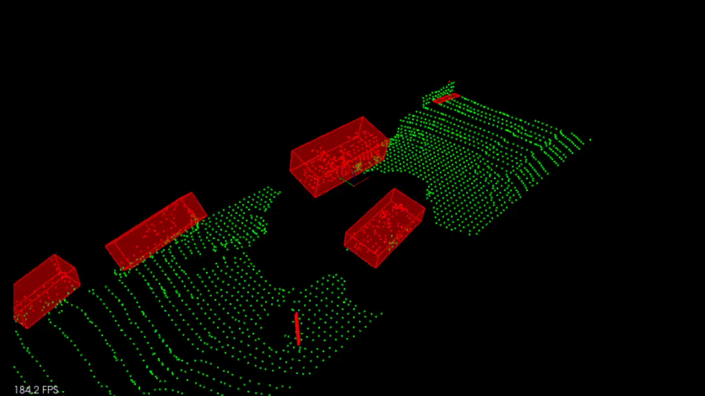

# Lidar Obstacle Detection

**Lidar** sensing gives us high resolution data by sending out thousands of laser signals. These lasers bounce off objects, returning to the sensor where we can then determine how far away objects are by timing how long it takes for the signal to return. Also we can tell a little bit about the object that was hit by measuring the intesity of the returned signal. Each laser ray is in the infrared spectrum, and is sent out at many different angles, usually in a 360 degree range. While lidar sensors gives us very high accurate models for the world around us in 3D, they are currently very expensive, upwards of $60,000 for a standard unit.

This work presents the algorithm and results obtained with the first project proposed by Udacity Sensor Fusion Engineer Nanodegree program. The main task of this project is obstacles detection with Lidar point cloud processing. The video below shows the results with the final algorithm implemented.



## Algorithm

**Step 1 - Make a voxel grid:**

Construct a voxel grid with the filtered point cloud, each voxel has the following size: filterRes x filterRes x filterRes.

**Step 2 - Crop the region of interest (ROI):** 

With minPoint and maxPoint parameters (3D points representing a cuboid), filters the region comprising only the road area.

**Step 3 - Crop the region corresponding to the car roof out area:**

As the car roof (where the lidar sensor is placed) points is not desired, exclude this area from the point cloud according to its 3D dimensions. 

**Step 4 - Segment the ground plane:**

Plane segmentation with RANSAC (Random Sample Consensus). 
RANSAC runs for a max number of iterations (maxIterations), and returns the model with the best fit. 
Each iteration randomly picks a subsample of the data and fits a plane model through it. Then the iteration with the highest number of inliers or the 
lowest noise is used as the best model. Points with distance to the found plane smaller than a threshold value (distanceTol) are considered as inliers.

**Step 5 - Cluster the objects above the ground:**

Euclidean clustering using KD-Tree for searching points during clustering task. 
A KD-Tree is a binary tree that splits points between alternating axes, this method brings more efficient computing processing.

**Step 6 - Find Bounding Boxes:**

Find Bounding boxes of the clusters applying [Principal Component Analysis (PCA)](https://en.wikipedia.org/wiki/Principal_component_analysis) including Z axis rotations.

## Source code structure

[./src/enviorment.cpp](https://github.com/Marconefs/SFND_Lidar_Obstacle_Detection/blob/main/src/environment.cpp) - main function

[./src/processPointClouds.h&cpp](https://github.com/Marconefs/SFND_Lidar_Obstacle_Detection/blob/main/src/processPointClouds.cpp) - Functions implementing the algorithm processing steps

[./src/ransac3d.h&cpp](https://github.com/Marconefs/SFND_Lidar_Obstacle_Detection/blob/main/src/ransac3d.cpp) - Comprises the Ransac implementation

[./src/cluster3d.h&cpp](https://github.com/Marconefs/SFND_Lidar_Obstacle_Detection/blob/main/src/cluster3d.cpp) - Comprises the clustering implementation
   
[./src/kdtree3d.h](https://github.com/Marconefs/SFND_Lidar_Obstacle_Detection/blob/main/src/kdtree3d.h) - Comprises the KD-Tree implementation

[./src/render/](https://github.com/Marconefs/SFND_Lidar_Obstacle_Detection/blob/main/src/render/) - rendering function for Point-Cloud

[./src//Sensors/](https://github.com/Marconefs/SFND_Lidar_Obstacle_Detection/blob/main/src/Sensors/) - real word Point-Cloud data


## Installation

### Ubuntu 

```bash
$> sudo apt install libpcl-dev
$> cd ~
$> git clone https://github.com/Marconefs/SFND_Lidar_Obstacle_Detection.git
$> cd SFND_Lidar_Obstacle_Detection
$> mkdir build && cd build
$> cmake ..
$> make
$> ./environment
```

### Windows 

http://www.pointclouds.org/downloads/windows.html

### MAC

#### Install via Homebrew
1. install [homebrew](https://brew.sh/)
2. update homebrew 
	```bash
	$> brew update
	```
3. add  homebrew science [tap](https://docs.brew.sh/Taps) 
	```bash
	$> brew tap brewsci/science
	```
4. view pcl install options
	```bash
	$> brew options pcl
	```
5. install PCL 
	```bash
	$> brew install pcl
	```

#### Prebuilt Binaries via Universal Installer
http://www.pointclouds.org/downloads/macosx.html  
NOTE: very old version 

#### Build from Source

[PCL Source Github](https://github.com/PointCloudLibrary/pcl)

[PCL Mac Compilation Docs](http://www.pointclouds.org/documentation/tutorials/compiling_pcl_macosx.php)
